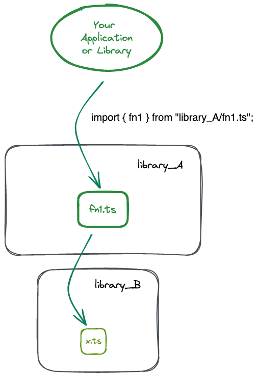

# Dependency Hell or Heaven

TLDR; Is Deno heading down the same dependency hell path as Node, due to the use
of the `deps.ts` & `mod.ts` conventions?

## Introduction

Node.js, or rather the conventions introduced by the npm ecosystem, is infamous
for it's dependency hell problems.

When Deno came along, with it's _import just what you need_ approach, there
seemed to be some light at the end of this tunnel.

I believe though, that some unfortunate conventions and advice has emerged
within the Deno ecosystem that could lead us back into this dependency hell
situation, although probably not to the extent of npm.

_What am I talking about?_

## deps.ts

It's commonly suggested to put all your dependencies into a `deps.ts` module so
you don't need to maintain absolute URLs in your imports everywhere.

This means that all your modules that have a dependency actually depend on ALL
of your dependencies not just what that module needs.

I know import maps are probably a better solution for an app, but they aren't
suitable for use inside library modules.

(I'm using the term _library_ loosely to mean a collection of associated
modules, generally within a common repo, and deployed together somewhere like
deno.land/x/_library_. I know these are also known as modules, but I use
_library_ to make the distinction for the sake of this discussion).

## mod.ts

Another suggestion for library authors is to expose all modules via a `mod.ts`.

This leads to consumers of your library depending on everything in your library
rather than just the parts they actually need.

## Dependency Hell

If the whole Deno ecosystem followed both of these patterns everywhere
(thankfully it doesn't), we'd spiral into a similar dependency hell as npm.

Here's an illustration of my point:

The Application only wants `fn1`, and only it's necessary transitive deps (in
green/bold), but by following the `deps.ts` & `mod.ts` pattern, it's getting
everything else (in red/dashed) regardless that it doesn't need it.

## Dependency Heaven

So how can we fix this?

The app could import the `fn1` directly from the `fn1.ts` module, and that in
turn just imports the specific modules directly from another library.

## The elephant in the room

Ok, but this means libraries need to have absolute URL imports throughout rather
than centralised in a single `deps.ts`.

What exactly is wrong with that?

You have to find and replace URLs?

Is that so bad when weighed up against dependency armageddon?

Maybe all we really need is a little extra tooling to aid maintenance of these
imports. To find and replace with a bit more context.

As for `mod.ts`, I'll admit it is very convenient to just import `mod.ts` and
have all things available, but it doesn't foster a healthy ecosystem.

Maybe what we need there is better module discovery within the IDEs, or a de-mod
tool that allows you to start off using a `mod.ts` import and then it expands
that out into direct imports.

## Put your money where your mouth is

I know I've pointed out problems, and only presented a half-arsed solution, and
I'm keen to rectify that. I'm hoping to actually get some time to work on the
tools I talk of. In the meantime, I hope this stirs up some ideas and healthy
discussion.

If you'd like to discuss this subject further please use the GitHub [discussion].

[discussion]: https://github.com/jollytoad/home/discussions/3
